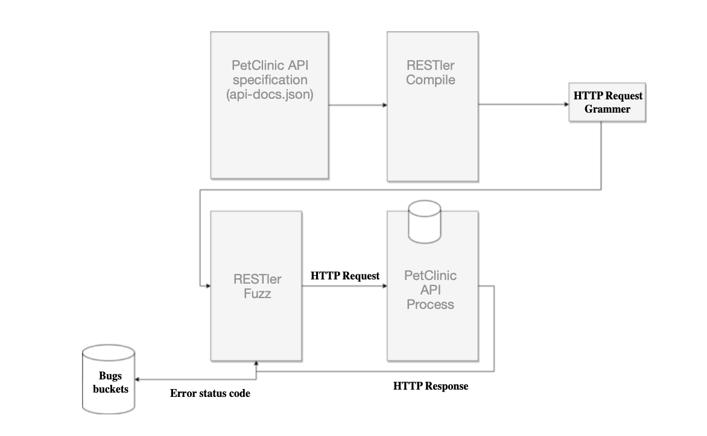
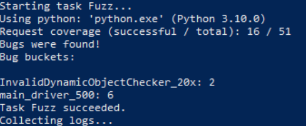

# RESTler

## What is RESTler?

RESTler is a fuzzing tool for automatically finding security and reliability bugs in RESTful services. For a given service
with an OpenAPI/Swagger specification, RESTler analyzes its entire specification, and then generates and executes tests that exercise the service through its REST API.


<br />

## Setting up the environment

RESTler was designed to run on 64-bit machines with Windows or Linux. Running on macOS is not stable as it is in experimental process.

You need to install [Python 3.8.2](https://www.python.org/downloads/) and [.NET 5.0](https://dotnet.microsoft.com/download/dotnet-core?utm_source=getdotnetcorecli&utm_medium=referral). Be careful about the Python version, as it should be exact the same.

After installing the prerequisites, you should clone the [RESTler repository](https://github.com/microsoft/restler-fuzzer)

Create a folder called ```restler_bin``` in the RESTler directory.

The Server (PetClinic) should be up, so the RESTler can send requests and retrieve the responses. The RESTler produce grammers based on the OAS. You can get PetClinic Open API file from http://localhost:9966/petclinic/v2/api-docs or [download](./api-docs.json) it from the repo.
Save this file as ```api-docs.json```

Go to the main directory of RESTler and run this command by terminal:
```
python ./build-restler.py --dest_dir <restler_root_directory>\restler_bin
```

And that’s it! restler_bin directory should be filled with binary files to run RESTler.

To compile the OAS and generate RESTler grammar, go the ```restler_bin/restler``` directory and run:
```
./restler compile --api_spec <root_path_to_OAS>\api-docs.json
```


To execute quickly all of the endpoints+methods in a compiled RESTler grammar for debugging the test setup and compute what parts of the Swagger spec are covered:
```
.\restler test --grammar_file <restler_root_directory>\restler_bin\restler\Compile\grammar.py --dictionary_file <restler_root_directory>\restler_bin\restler\Compile\dict.json --settings <restler_root_directory>\restler_bin\restler\Compile\engine_settings.json --no_ssl
```


To execute once every endpoint+method in a compiled RESTler grammar with a default set of checkers to see if bugs can be found quickly:
```
.\restler fuzz-lean --grammar_file <restler_root_directory>\restler_bin\restler\Compile\grammar.py --dictionary_file <restler_root_directory>\restler_bin\restler\Compile\dict.json --settings <restler_root_directory>\restler_bin\restler\Compile\engine_settings.json --no_ssl
```


To explore a RESTler fuzzing grammar in smart breadth-first-search mode for finding more bugs. This may take a long time due to the system you are running. In our case it takes around two hours.
```
.\restler fuzz --grammar_file <restler_root_directory>\restler_bin\restler\Compile\grammar.py --dictionary_file <restler_root_directory>\restler_bin\restler\Compile\dict.json --settings <restler_root_directory>\restler_bin\restler\Compile\engine_settings.json --no_ssl
```

After running the above commands, RESTler prints the results:
<br />

<br />

You can access to the requests and responses during the fuzzing via this directory:
```<restler_root_directory>\restler_bin\restler\Fuzz\RestlerResults\experiment___\logs\network.testing.____.txt```

Also it is possible to extend the dictionary of the RESTler by editing this file:
```<restler_root_directory>\restler_bin\restler\Compile\dict.json```

You can find both [dictionary](./dict.json) and RESTler [produced request/response](./network.testing.11156.1.txt) files in this repository
